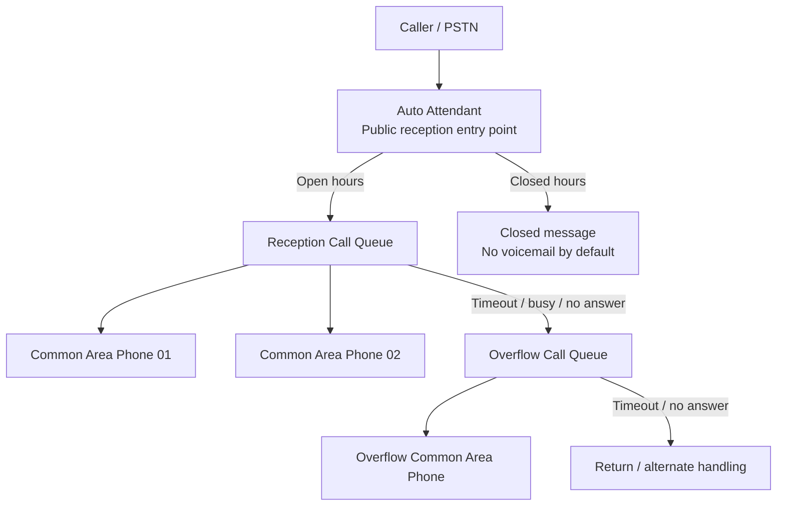

## Pattern 06 — Teams Phone receptionist flow with Common Area Phones

### Context

A service-oriented or regulated organization needs to expose a main reception number while distributing calls to one or more shared physical Teams phones used by front-desk or reception agents.

The reception service is not just a phone on a desk. It is a small voice service made of:

- a public entry point;
- schedule and exception handling;
- queue-based distribution;
- shared endpoint identities;
- overflow and timeout behavior;
- clear BUILD → RUN ownership.

This pattern applies when reception endpoints are delivered through Microsoft Teams Phone with Auto Attendants, Call Queues, Resource Accounts and Common Area Phone-style accounts.

### Problem

A common implementation shortcut is to assign direct public numbers to every reception phone and let each endpoint behave like an independent line.

That creates avoidable operational ambiguity:

- the reception service is split across several direct numbers;
- call-flow ownership becomes unclear;
- overflow behavior is not explicit;
- support teams cannot easily tell whether the issue is the entry point, the queue, the shared account, the physical phone, or the PSTN/operator boundary;
- reporting may show endpoint accounts rather than the real people physically handling the desk.

### Decision

Model the reception desk as a service entry flow:

```text
Caller
  -> Public reception number
  -> Auto Attendant
  -> Reception Call Queue
  -> Common Area Phone endpoints
  -> Overflow / timeout target
```

Use:

- **Auto Attendant** for the public service entry point, greetings, schedules and exceptional closures;
- **Call Queue** for distribution to shared reception endpoints;
- **Resource Accounts** for the Auto Attendant and Call Queue identities;
- **Common Area Phone / shared device accounts** for physical Teams phones;
- **no direct public DID on shared reception phones by default**, unless a specific business requirement justifies it;
- explicit timeout and overflow behavior before handover to RUN.

### Reference call flow



### Design decisions

#### Decision 1 — Assign the public number to the service entry point

The public number should represent the reception service, not an individual desk phone.

This makes the service easier to explain, test and support:

- callers use one official number;
- schedules and greetings are centralized;
- changes to desk phones do not change the public entry point;
- support can start diagnostics from the service object.

#### Decision 2 — Keep Resource Accounts and endpoint accounts separate

Resource Accounts represent Teams Phone service objects such as Auto Attendants and Call Queues.

Common Area Phone / shared device accounts represent physical endpoints used by reception desks.

Do not use a Resource Account as a sign-in identity for a physical phone. Do not use a personal user account for a shared reception phone unless there is a deliberate and documented reason.

#### Decision 3 — Do not assign direct public numbers to shared reception phones by default

The shared phones receive calls through the Call Queue.

A direct DID on every shared phone may be justified in some cases, but it should not be the default design because it can bypass the controlled reception flow.

If outbound PSTN calls are required from shared reception accounts, the presented caller ID must be explicitly designed:

- service number presentation through Teams caller ID policy;
- operator/SBC treatment when required;
- or another approved CLI model.

#### Decision 4 — Make timeout and overflow explicit

Reception flows are often where user experience problems appear first.

Before handover, the design must define:

- what happens when all reception endpoints are busy;
- what happens when no endpoint answers;
- timeout values;
- whether overflow returns to the main queue, routes to another queue, routes to another site, or plays a message;
- whether a loop is possible and how it is prevented.

#### Decision 5 — Treat physical phones as RUN assets

Each Teams phone must have an operational identity:

- account;
- license;
- location / desk;
- device model;
- sign-in state;
- queue membership;
- support owner;
- replacement process.

The service is not delivered only when the call works once. It is delivered when support can diagnose and restore it.

### Operating notes

Support needs a short and reliable diagnostic path:

1. Confirm the symptom: date, time, caller, called number, observed behavior.
2. Identify the service object: Auto Attendant, primary Call Queue, overflow Call Queue.
3. Validate schedule / holiday / exception behavior.
4. Validate Call Queue membership and routing method.
5. Validate shared device account state.
6. Validate physical phone sign-in and health in Teams Admin Center.
7. Test a direct Teams call to the shared endpoint account.
8. Test a call through the Call Queue.
9. If the issue is PSTN, caller ID, media path or carrier-side routing, escalate using the operator boundary.

### Evidence expectations

A clean handover should include:

- call-flow diagram;
- Auto Attendant summary;
- Call Queue summary;
- Resource Account list;
- Common Area Phone / shared endpoint account list;
- queue membership summary;
- device inventory;
- license summary;
- test evidence;
- timeout / overflow decisions;
- known limitations;
- RUN ownership notes.

### Acceptance criteria

Minimum acceptance criteria:

- inbound calls to the public reception number reach the Auto Attendant;
- open-hours routing reaches the reception Call Queue;
- shared Teams phones ring according to the selected routing method;
- no-answer / busy / timeout behavior matches the documented design;
- closed-hours behavior matches the validated business message;
- shared phone accounts have no direct DID unless explicitly documented;
- outbound caller ID behavior is documented if outbound PSTN calling is allowed;
- phones are visible, signed in and operational;
- support has enough information to diagnose the service after handover.

### Anti-patterns

Avoid:

- assigning direct public numbers to every reception phone without a documented reason;
- using personal user accounts for shared reception desks;
- mixing Resource Account purpose and physical endpoint sign-in purpose;
- delivering Auto Attendants and Call Queues without test evidence;
- configuring overflow without documenting loop risk;
- handing over to RUN without a device/account/queue mapping;
- claiming that the service is complete because one inbound call succeeded.

### Trade-offs

**Benefits**

- clearer service ownership;
- better operational readability;
- simpler support triage;
- reduced dependency on physical phone replacement events;
- cleaner handover evidence.

**Costs / constraints**

- requires disciplined naming and inventory;
- requires explicit caller ID design for outbound calls from shared accounts;
- requires testing of queue behavior, not only phone sign-in;
- reporting may identify the shared endpoint account rather than the person physically present at the desk.

### Proof links

Technical proof artefacts for this pattern should live in the public technical portfolio rather than in this narrative repository.

Recommended portfolio entry points:

- `docs/templates/dat-teams-phone-aa-cq-common-area-phones.md`
- `docs/templates/handover-run.md`
- `docs/templates/runbook-catalog.md`
- generated `DAT-snippets.md` and evidence packs where applicable.
